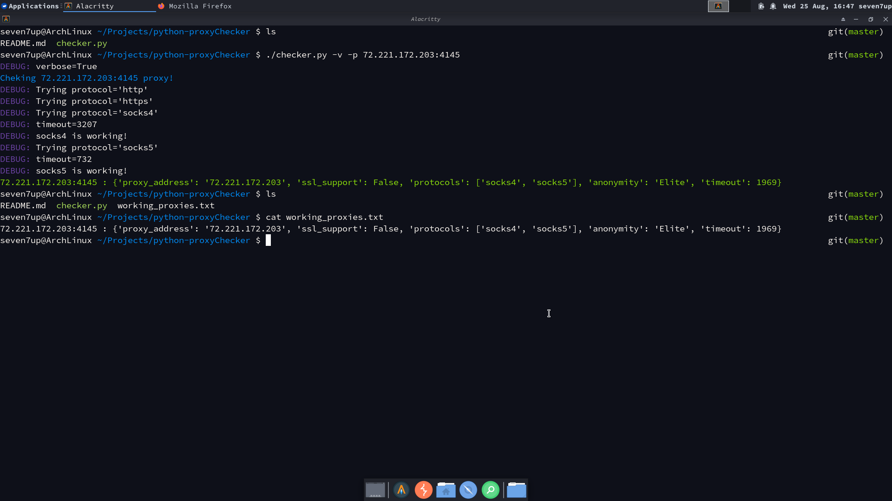
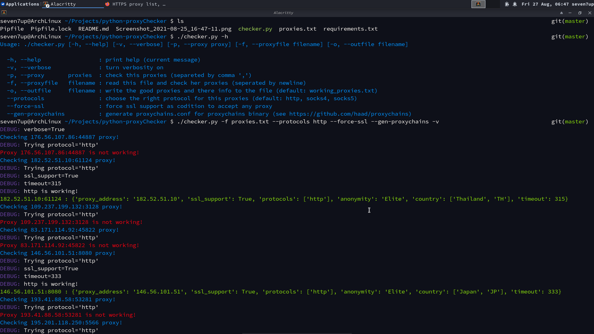
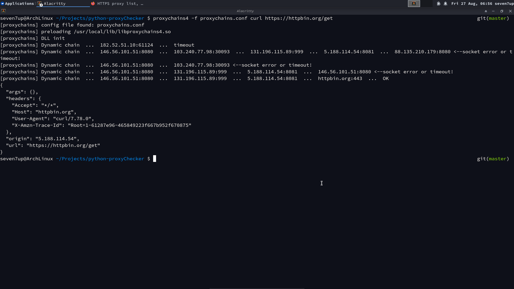

# Python-ProxyChecker

## About:






Python proxy checker script, using pycurl, colorama and [ricerati/proxy-checker-python](https://github.com/ricerati/proxy-checker-python/) project.

Thanks for everyone writed one word.

## Setup

Get this repo with git:

```
git clone https://github.com/Seven-7Up/python-proxyChecker.git
```

OR download it as [tarrbal](https://github.com/Seven-7Up/python-proxyChecker/archive/master.tar.gz) or for [zip](https://github.com/Seven-7Up/python-proxyChecker/archive/master.zip)

run pip command:

```
pip install -r requirements.txt
```

or pip env command:

```
pipenv install
```

to install [`colorama`](https://github.com/tartley/colorama).

## Usage:

Run the script:

```
python3 checker.py
```

```
./checker.py
```

For help, use:

```
./checker --help
```

```
Usage: ./checker.py [-h, --help] [-v, --verbose] [-p, --proxy proxy] [-f, --proxyfile filename] [-o, --outfile filename]

  -h, --help                 : print help (current message)
  -v, --verbose              : turn verbosity on
  -p, --proxy       proxies  : check this proxies (separeted by comma ',')
  -f, --proxyfile   filename : read this file and check her proxies (seperated by newline)
  -o, --outfile     filename : write the good proxies and there info to the file (default: working_proxies.txt)
  --protocols                : choose the right protocol for this proxies (default: http, socks4, socks5)
  --force-ssl                : force ssl support as codition to accept any proxy
  --gen-proxychains          : generate proxychains.conf for proxychains binary (see https://github.com/haad/proxychains)
```

Basic usage:

```
./checker.py -p 10.0.0.132:4045,192.168.0.32 -v
```

Have fun ;)
